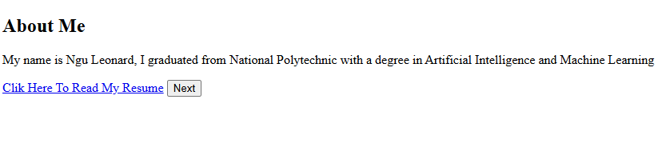

# 1. Introduction to HTML

## 1.1 Introduction to HTML

HTML (HyperText Markup Language) is mark up language that is used to create and structure web pages.

## 1.2 HTML Elements

This is a generic term used to describe anything that be displayed on a web page e.g paragraph tags, header tags, etc.

## 1.3 Redering order of HTML

Basicly HTML elements that appear first in the program will be rendered or displayed first (that is a first come first served).

> (do a small example with two paragraph tags)

> Example 1

```html
<p>This is the first element</p>
<button>This is the second element</button>
```

> Example 2

```html
<button>This is the FIRST element</button>
<p>This is the SECOND element</p>
```

## 1.4 HTML Syntax

The sytax for writing an html element usualy follows a simple parttern that is as follows:

```html
<tag>content</tag>
```

(explain the above format detaily)

> Example

```html
<p>This is my html program</p>
```

## 1.5 Some Basic HTML Elements

### Headers

These are elements use to display headings on a web page written as:

```html
<h1>This is a header</h1>
```

> **NB: header elements range from h1 to h6 the higher the number the smaller the size, and the less the importance of the heading being displayed.**

(display visual example of this)

> Example

```html
<h1>Heading</h1>
<h2>Heading</h2>
<h3>Heading</h3>
<h4>Heading</h4>
<h5>Heading</h5>
<h6>Heading</h6>
```

### Paragraphs

This is an element used to display a line or paragraph of text.

> Example

```html
<p>This is a line of text</p>
```

### Buttons

This is an element used to display a button on a web page.

> Example

```html
<button>Click Me</button>
```

### Anchors

These are elements used to display links/hyper links

e.g

> Example

```html
<a>This is a link to my web page</a>
```

> > **NB: Notice when the link is clicked nothing happens, this link will only work with the help of the next html concept called attributes**.

## 1.6 HTML Attributes

This is HTML syntax used to modify the way html elements behave. attributes are written following this format:

```html
<tag attribute="value">content</tag>
```

Let us make use of the power of attributes to modify the behavio of our achors/links.

> Example 1: Making or Link lead to a web page on the internet

```html
<a href="https://www.youtube.com">Link to Youtube</a>
```

> > Explanation: the `href` attribute allows us to provide a web page that our link, leads a user to when they click, and the value it takes is the link/address of the web page we want it to lead to.

> Example 2: Making the link open on a new tab

```html
<a href="https://www.youtube.com" target="_blank">Link to Youtube</a>
```

> > Explanation: the `target="_blank"` attribute an value species that the link should be opened in a new tag instead of the same web page

> > > **_Exercise (Walk through): Build the following web page_**



> > > **_Exercise (on your own): Build the following web page_**


