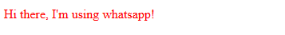

# 2. Introduction to CSS

CSS (Cascading Style Sheets) is a style sheet language used to modify the appearance of HTML elements.

> Keeping in mind the project-oriented nature of this course, we will explore CSS through a simple project.

## 2.1 CSS Syntax

CSS can be written in multiple areas of our code, but for now, we will write all CSS within the `style` tag inside our HTML file.

CSS follows this syntax:

```css
selector {
  property: value;
  property: value;
  ...;
}
```

> **Explanation:**
>
> - **Selector**: Specifies the HTML element to be styled.
> - **Property**: Defines the specific style to apply (e.g., `color`, `font-size`).
> - **Value**: Specifies the value for the property (e.g., `red`, `16px`).

### Example: Build the following UI



## 2.2 Labeling and Targeting HTML Elements

### Labeling Elements

We label HTML elements to identify specific elements and modify their appearance using CSS. This can be done in two ways using two HTML attributes:

1. **The `class` Attribute**

   To label an element using a `class` attribute, we do the following:

   ```html
   <button class="label">My Button</button>
   ```

2. **The `id` Attribute**

   To label an element using an `id` attribute, we do the following:

   ```html
   <button id="label">My Button</button>
   ```

> **Note:** Multiple elements can share the same `class`, but `id` attributes are used to uniquely identify elements. Use each based on the need.

### Targeting Elements

We target elements for styling in three main ways:

1. **By Element Name**

   ```css
   elementName {
     property: value;
     property: value;
     ...;
   }
   ```

2. **By Class**

   ```css
   .className {
     property: value;
     property: value;
     ...;
   }
   ```

3. **By ID**

   ```css
   #id {
     property: value;
     property: value;
     ...;
   }
   ```

## 3. Introduction to Styling with CSS

Since there are numerous CSS properties, studying each one individually would be inefficient. Instead, we will learn them based on the requirements of our projects.

Let us build the following UI together to get a grasp of styling elements with CSS.


> **Note:** You do not need to memorize all CSS properties. With time and by building many UIs, you will intuitively learn the most important ones. For uncommon cases, you can always search online or ask AI for help.

### Exercises

#### Exercise 1

<iframe
  width="1280"
  height="720"
  src="lesson2-exercise-1.mp4"
  frameborder="0"
  allowfullscreen
></iframe>

#### Exercise 2


#### Exercise 3


