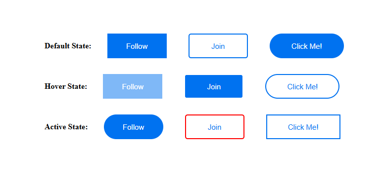
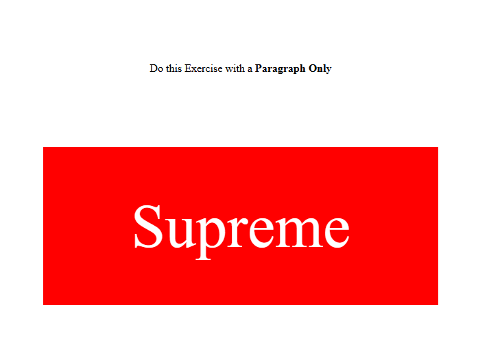
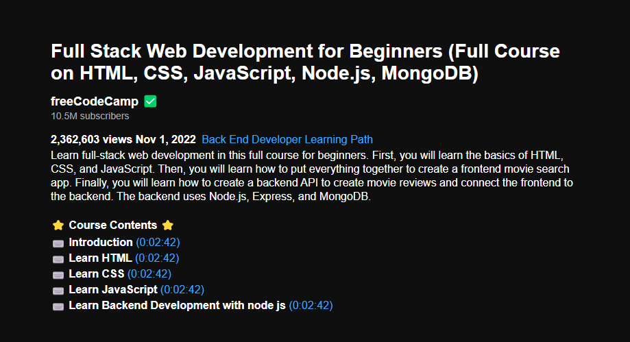
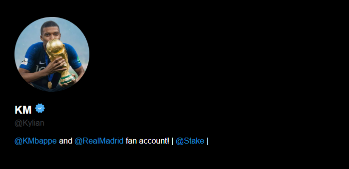

# 0. Introduction

## 0.1 Disclaimer

This course is an attempt to refresh the interns of BitSpark on the most fundamental concepts of HTML, CSS, and JavaScript. This is **NOT** a course for absolute beginners.

## 0.2 Purpose of This Course

The purpose of this course is to get into actual practical work as soon as possible, as this course is project-oriented rather than theory-oriented.

## 0.3 Prerequisites

> The only prerequisite for this course is a basic understanding of HTML and CSS, as JavaScript will be the core focus and will be taught from scratch.

## 0.4 Course Content

### 0.4.1 HTML, CSS, and Tailwind CSS

#### HTML and CSS

| Section      | Subtopics                                                                                                                                                                                                                                                                                                                                                                                                                  |
| ------------ | -------------------------------------------------------------------------------------------------------------------------------------------------------------------------------------------------------------------------------------------------------------------------------------------------------------------------------------------------------------------------------------------------------------------------- |
| HTML and CSS | _ HTML and CSS Basics <br> _ Hovers, Transitions, Shadows <br> _ Chrome DevTools & CSS Box Model <br> _ Text Styles <br> _ The HTML Structure <br> _ Images and Text Boxes <br> _ CSS Display Property <br> _ The `div` Element <br> _ Nested Layouts Technique <br> _ CSS Grid <br> _ Flexbox <br> _ Nested Flexbox <br> _ CSS Position <br> _ Position Absolute and Relative <br> \* More CSS Features and Media Queries |

#### Tailwind CSS Basics

| Section      | Subtopics                                                                                                                                                                                                                                                            |
| ------------ | -------------------------------------------------------------------------------------------------------------------------------------------------------------------------------------------------------------------------------------------------------------------- |
| Tailwind CSS | _ Introduction <br> _ Setup <br> _ Colors <br> _ Customization <br> _ Typography <br> _ Spaces & Sizes <br> _ Flex <br> _ Grids <br> _ Layouts <br> _ Borders <br> _ Effects & Filters <br> _ Animations <br> _ Design System <br> _ Core Concepts <br> \* Dark Mode |

### 0.4.2 JavaScript

| Lesson Plan                        | Topics                                                                                                                                                                                                                                                               |
| ---------------------------------- | -------------------------------------------------------------------------------------------------------------------------------------------------------------------------------------------------------------------------------------------------------------------- |
| Introduction to Programming        | _ What is Programming? <br> _ How JavaScript Fits in Web Development <br> _ Setting Up a Development Environment (VS Code, Node.js, Browser DevTools) <br> _ Writing Your First JavaScript Code                                                                      |
| JavaScript Basics                  | _ Variables and Data Types (String, Number, Boolean, etc.) <br> _ Operators (Arithmetic, Comparison, Logical) <br> _ Strings and Template Literals <br> _ Working with Numbers (Math Operations, Random, Rounding)                                                   |
| Control Flow                       | _ Conditional Statements (`if`, `else`, `switch`) <br> _ Loops (`for`, `while`, `do-while`) <br> \* Break and Continue Statements                                                                                                                                    |
| Functions & Scope                  | _ Defining and Calling Functions <br> _ Function Parameters and Return Values <br> _ Arrow Functions <br> _ Scope (Global vs Local Variables) <br> \* Closures and Hoisting (Basic Understanding)                                                                    |
| Arrays & Objects                   | _ Arrays (Creating, Modifying, Looping through Arrays) <br> _ Array Methods (`map`, `filter`, `reduce`, etc.) <br> _ Objects and Object Literals <br> _ Object Methods and `this` Keyword                                                                            |
| DOM Manipulation                   | _ What is the DOM? <br> _ Selecting Elements (`document.querySelector`, `getElementById`, etc.) <br> _ Modifying Elements (`innerText`, `innerHTML`, styles) <br> _ Handling Events (`click`, `input`, `keydown`, etc.) <br> \* Event Listeners and Event Delegation |
| Working with Forms & User Input    | _ Capturing User Input <br> _ Form Validation <br> \* Preventing Default Form Submission                                                                                                                                                                             |
| Asynchronous JavaScript            | _ What is Asynchronous Programming? <br> _ Callbacks vs Promises vs Async/Await <br> _ Fetch API for Making HTTP Requests <br> _ Handling JSON Data                                                                                                                  |
| Error Handling & Debugging         | _ Understanding Errors (Syntax, Runtime, Logical Errors) <br> _ Try-Catch for Error Handling <br> \* Debugging with Browser DevTools                                                                                                                                 |
| Local Storage & APIs               | _ Storing Data in Local Storage <br> _ Retrieving and Removing Data from Storage <br> \* Fetching Data from Public APIs (e.g., JSONPlaceholder, OpenWeather API)                                                                                                     |
| ES6+ Features                      | _ `let` & `const` vs `var` <br> _ Destructuring Arrays and Objects <br> _ Spread and Rest Operators <br> _ Modules and `import/export` <br> \* Template Literals and Enhanced Object Literals                                                                        |
| JavaScript in the Browser          | _ Introduction to the Window Object <br> _ Timers (`setTimeout`, `setInterval`) <br> \* Browser Storage (Cookies, Local Storage, Session Storage)                                                                                                                    |
| Object-Oriented JavaScript (OOP)   | _ Introduction to OOP <br> _ Constructor Functions and Prototypes <br> _ ES6 Classes and `extends` <br> _ Getters and Setters                                                                                                                                        |
| Advanced JavaScript Concepts       | _ Closures and Lexical Scope <br> _ The Event Loop & Call Stack <br> _ Debouncing & Throttling <br> _ Web Workers & Performance Optimization                                                                                                                         |
| Mini Projects                      | _ To-Do List App <br> _ Weather App (Using Fetch API) <br> _ Calculator <br> _ Notes App with Local Storage <br> \* Simple Game (Rock, Paper, Scissors)                                                                                                              |
| JavaScript Frameworks & Next Steps | _ Introduction to Frameworks (React, Vue, etc.) <br> _ When to Use JavaScript vs a Framework <br> \* Learning Resources & Next Steps                                                                                                                                 |

## 0.5 Required Tools

- A web browser
- Visual Studio Code
- Live Server Extension

## 0.6 Getting Started

To assess where everyone is at, we will start with a small, easy individual project.

### The Task

> Build a subscribe button that, when clicked, changes from a "Subscribe" state to a "Subscribed" state.

<iframe
  width="1280"
  height="720"
  src="lesson0.mp4"
  frameborder="0"
  allowfullscreen
></iframe>

### Todo

- create a folder called Front-End
- create a sub folder called html-and-css **_This is where the html and css part of the course will be done_**

# 1. Introduction to HTML

## 1.1 Introduction to HTML

HTML (HyperText Markup Language) is mark up language that is used to create and structure web pages.

## 1.2 HTML Elements

This is a generic term used to describe anything that be displayed on a web page e.g paragraph tags, header tags, etc.

## 1.3 Redering order of HTML

Basicly HTML elements that appear first in the program will be rendered or displayed first (that is a first come first served).

> (do a small example with two paragraph tags)

> Example 1

```html
<p>This is the first element</p>
<button>This is the second element</button>
```

> Example 2

```html
<button>This is the FIRST element</button>
<p>This is the SECOND element</p>
```

## 1.4 HTML Syntax

The sytax for writing an html element usualy follows a simple parttern that is as follows:

```html
<tag>content</tag>
```

(explain the above format detaily)

> Example

```html
<p>This is my html program</p>
```

## 1.5 Some Basic HTML Elements

### Headers

These are elements use to display headings on a web page written as:

```html
<h1>This is a header</h1>
```

> **NB: header elements range from h1 to h6 the higher the number the smaller the size, and the less the importance of the heading being displayed.**

(display visual example of this)

> Example

```html
<h1>Heading</h1>
<h2>Heading</h2>
<h3>Heading</h3>
<h4>Heading</h4>
<h5>Heading</h5>
<h6>Heading</h6>
```

### Paragraphs

This is an element used to display a line or paragraph of text.

> Example

```html
<p>This is a line of text</p>
```

### Buttons

This is an element used to display a button on a web page.

> Example

```html
<button>Click Me</button>
```

### Anchors

These are elements used to display links/hyper links

e.g

> Example

```html
<a>This is a link to my web page</a>
```

> > **NB: Notice when the link is clicked nothing happens, this link will only work with the help of the next html concept called attributes**.

## 1.6 HTML Attributes

This is HTML syntax used to modify the way html elements behave. attributes are written following this format:

```html
<tag attribute="value">content</tag>
```

Let us make use of the power of attributes to modify the behavio of our achors/links.

> Example 1: Making or Link lead to a web page on the internet

```html
<a href="https://www.youtube.com">Link to Youtube</a>
```

> > Explanation: the `href` attribute allows us to provide a web page that our link, leads a user to when they click, and the value it takes is the link/address of the web page we want it to lead to.

> Example 2: Making the link open on a new tab

```html
<a href="https://www.youtube.com" target="_blank">Link to Youtube</a>
```

> > Explanation: the `target="_blank"` attribute an value species that the link should be opened in a new tag instead of the same web page

> > > **_Exercise (Walk through): Build the following web page_**


> > > **_Exercise (on your own): Build the following web page_**


# 2. Introduction to CSS

CSS (Cascading Style Sheets) is a style sheet language used to modify the appearance of HTML elements.

> Keeping in mind the project-oriented nature of this course, we will explore CSS through a simple project.

## 2.1 CSS Syntax

CSS can be written in multiple areas of our code, but for now, we will write all CSS within the `style` tag inside our HTML file.

CSS follows this syntax:

```css
selector {
  property: value;
  property: value;
  ...;
}
```

> **Explanation:**
>
> - **Selector**: Specifies the HTML element to be styled.
> - **Property**: Defines the specific style to apply (e.g., `color`, `font-size`).
> - **Value**: Specifies the value for the property (e.g., `red`, `16px`).

### Example: Build the following UI


## 2.2 Labeling and Targeting HTML Elements

### Labeling Elements

We label HTML elements to identify specific elements and modify their appearance using CSS. This can be done in two ways using two HTML attributes:

1. **The `class` Attribute**

   To label an element using a `class` attribute, we do the following:

   ```html
   <button class="label">My Button</button>
   ```

2. **The `id` Attribute**

   To label an element using an `id` attribute, we do the following:

   ```html
   <button id="label">My Button</button>
   ```

> **Note:** Multiple elements can share the same `class`, but `id` attributes are used to uniquely identify elements. Use each based on the need.

### Targeting Elements

We target elements for styling in three main ways:

1. **By Element Name**

   ```css
   elementName {
     property: value;
     property: value;
     ...;
   }
   ```

2. **By Class**

   ```css
   .className {
     property: value;
     property: value;
     ...;
   }
   ```

3. **By ID**

   ```css
   #id {
     property: value;
     property: value;
     ...;
   }
   ```

## 3. Introduction to Styling with CSS

Since there are numerous CSS properties, studying each one individually would be inefficient. Instead, we will learn them based on the requirements of our projects.

Let us build the following UI together to get a grasp of styling elements with CSS.


> **Note:** You do not need to memorize all CSS properties. With time and by building many UIs, you will intuitively learn the most important ones. For uncommon cases, you can always search online or ask AI for help.

### Exercises

#### Exercise 1

<iframe
  width="1280"
  height="720"
  src="lesson2-exercise-1.mp4"
  frameborder="0"
  allowfullscreen
></iframe>

#### Exercise 2


#### Exercise 3


# 3. Pseudo-classes, Typography, and the CSS Box Model: Refactoring Our Code

## 1. Pseudo-classes

A pseudo-class is a special keyword added to a CSS selector to style an element only in a particular state. In this section of the course, we are going to look at two special CSS pseudo-classes:

### Hover

The `:hover` pseudo-class is used to style an element only when a user's mouse is hovering over that element. It follows this format:

```css
.selector:hover {
  property: value;
  property: value;
  /* ... */
}
```

> (do an example here)

### Active

The `:active` pseudo-class allows us to style an element only when the user clicks on that element. It follows this format:

```css
.selector:active {
  property: value;
  property: value;
  /* ... */
}
```

> (do an example)

### Transitions

By default, changes that occur when elements are in a hover or active state are immediate. However, CSS provides a property called `transition` that is used to smoothly animate the changes between states. It follows this format:

```css
.selector:active {
  transition: property time_in_seconds;
}
```

> Example: Let us now recall our subscribe button from the beginning of the course and build something similar using the concepts we just learned.

> > Exercise: Build the following UI with default, hover, and active states:
> > 

---

## 2. CSS Box Model

The CSS Box Model is a concept that determines how much space an element occupies on a web page and its distance from other elements.

Before we dive deeper into this concept, let us look at a tool provided by our web browsers to better understand the CSS Box Model, called **Chrome DevTools**.

### How to Access Chrome DevTools

#### Manually

- **Right-click** on your web page.
- Select **Inspect**.
- A new section should appear on the web page.

#### Using a Shortcut

`Ctrl + Shift + I` (Windows/Linux) or `Cmd + Option + I` (macOS)

> Analyze an element with the help of Chrome DevTools with the interns.

### Elements of the Box Model

#### 1. Borders

We have already discussed borders with our buttons.

#### 2. Margins

Margins are used to define the space that surrounds an element. A margin can be applied to the left, right, top, or bottom of an element.

#### 3. Padding

Padding defines the space between the content and the border of an element. It, too, can be applied to the left, right, top, or bottom.

#### Different Ways of Adding Margins and Padding

##### Method 1: By Direction

Styling an element's margin or padding by direction looks like this:

```css
.btn {
  margin-left: 2px;
  margin-right: 2px;
  margin-top: 2px;
  margin-bottom: 2px;
}
```

or

```css
.btn {
  padding-left: 2px;
  padding-right: 2px;
  padding-top: 2px;
  padding-bottom: 2px;
}
```

##### Method 2: By Dimensions

You can also use shorthand to apply values by dimensions:

```css
.selector {
  property: top-bottom-value left-right-value;
}
```

For example:

```css
.btn {
  margin: 2px 2px;
}
```

or

```css
.btn {
  padding: 2px 2px;
}
```

> Example (walkthrough): Rebuild the subscribe button using the Box Model concepts.

> **Note:** Why would you choose to style an element with padding rather than height and width? **Most of the time, elements are designed without knowing exactly the content they will hold. For example, buttons can be designed without knowing exactly what text they will contain. If you use fixed height and width, then if the text is too long, it may overflow the button and cause inconsistency. With padding, we do not have this problem.**

> Exercise: Build the following UI using only a paragraph:



---

## 3. Typography


Most of us are familiar with the above image; this is the toolbar in Word that allows us to modify how text looks in a document. CSS provides us with an array of properties to do the same.

### Some Fundamental CSS Typography Concepts

> Each concept will be demonstrated with an example paragraph.

List of properties to test:

- font-size
- font-family
- font-weight
- font-style
- text-align
- text-decoration
- color
- width
- line-height

### Nesting Other Elements Within Paragraphs

HTML provides an inline container that lets us add other elements within paragraphs, called a `span`, written as follows:

```html
<span>content</span>
```

#### Nesting a Span in a Paragraph

To nest a span within a paragraph, do as follows:

```html
<p>Content <span>span content</span></p>
```

> **Note:** A span within a paragraph can have its own class, and its content can be styled differently from that of the paragraph. **(do an example)**

> Example (walkthrough): Build the following UI:


> Final Example: Let us work on a small project that utilizes all the knowledge we've acquired so far. Build the following UI:



> **Weekend Assignment:** Build the following UI on your own.


---

# Lesson 4: Introduction to Beginner CSS

## Part 1: Some Other Pre-Beginner Concepts to Know

### 1.1 External CSS

So far, we have been working with the `<style>` tag to add CSS styling to our elements. However, on a professional scale, we use external CSS.

> **What is External CSS?**  
> External CSS means writing CSS in a separate file from your HTML and then linking them together.

#### How to Achieve This

- **Create a CSS file:**  
  Create a file called `style.css` (always use the `.css` extension).

- **Link the CSS file in your HTML:**  
  In your HTML file, add the following tag within the `<head>` section:

  ```html
  <link rel="stylesheet" href="style.css" />
  ```

- **Provide the correct path:**  
  For the value of the `href` attribute, provide the relative path to your CSS file.

#### 1.1.1 How to Link Files in HTML

1. **Absolute Paths**

   An absolute path specifies the full location of a file on your system. For example, if you were navigating from your computer's C: drive, it might look like:

   ```plain
   C:\Users\SPVCEMVN\Desktop\Internship HTML-CSS-JS\styles.css
   ```

2. **Relative Paths**

   A relative path describes where a file is located in relation to the current document. For example:

   ```plaintext
   ../../styles.css
   ```

   or

   ```plaintext
   ./styles.css
   ```

   _(Note: `../../styles.css` navigates up two directories, while `./styles.css` refers to a file in the current directory.)_

**We will only use relative paths throughout this course.**

> **Why Use a Relative Path?**
>
> - A relative path specifies the location of a file relative to the current document (or the root of the project), making it flexible regardless of where the website is hosted.
> - An absolute path specifies the full location of a file (e.g., `C:/Users/YourName/Desktop/image.jpg` or `http://example.com/image.jpg`), which can cause issues when moving files between environments.

---

## Part 2: Working with Images

### How to Download an Image from the Internet

- **Search:** Look for an image on Google.
- **Right-click:** Right-click on the image you want.
- **Save:** Click on "Save image as..."
- **Store:** Save the image on your computer.

### The Image Element

To add an image to a webpage, use the `` element as follows:

```html

```

_(Explain the tag in detail.)_

### The `object-fit` Property

The `object-fit` property defines how an image will fit within its container. We will look at three main values for this property:

1. **cover**  
   Scales the image to fully cover the container while maintaining its aspect ratio. The disadvantage is that it might crop the image.
2. **fill**  
   Stretches the image to completely fill the container, ignoring the aspect ratio (this can distort the image).
3. **contain**  
   Scales the image to fit inside the container while maintaining its aspect ratio, leaving empty space if needed.

> **Example:** Build the following UI:  
> 

**Exercise:** Build the following UI on your own:  


---

## Part 3: Introduction to Form Elements

Forms are components of web applications that allow users to send data to the server. The HTML element for a form is as follows:

```html
<form>...</form>
```

Inside the `<form>` element, you can include various elements to create the forms we use in our everyday lives. Let’s look at two fundamental elements:

1. **Labels**

   ```html
   <label for="input-id">Label Text</label>
   ```

2. **Input Fields**

   ```html
   <input type="text" placeholder="Enter text here" />
   ```

The `type` attribute for the `<input>` field determines which type of input is displayed on the web page. For example:

```html
<input type="password" placeholder="Enter your password" />
```

The `placeholder` attribute provides a default text inside the input field that disappears when the user starts typing.

Some common input types include:

- `text`
- `number`
- `email`
- `password`
- `tel`
- `search`
- `date`
- `radio`
- `checkbox`
- _etc._

Each input type behaves differently.

> **NB:** Aside from form elements, any HTML element can be placed within the `<form>...</form>` tag.

---

## Part 4: The Display Property

The `display` property in CSS defines how an element is rendered on a webpage. We will study two basic values of this property:

1. **block:**  
   The element occupies the full width available on the webpage, starting on a new line.
2. **inline-block:**  
   The element takes up only as much width as necessary and can sit inline with other elements.

_(Include examples here.)_

**Example:** Let’s build the following UI together:  


**Exercise:** Try building the following UI on your own:  


---

## Part 5: The `<div>` Element

The `<div>` element is essentially a container that can hold other elements, including nested `<div>` elements. We will explore it more in later lessons, but for now, here is how it is written:

```html
<div></div>
```

**Example of using a `<div>`:**

```html
<div>
  <p>Hi there</p>
  <button>Click me!</button>
</div>
```

> **NB:** The `<div>` is one of the most important and widely used elements in web development. For a fun exercise, inspect any webpage of your choice and observe how many `<div>` elements are used.

(do a small grid example)

**Assignment:**


---
