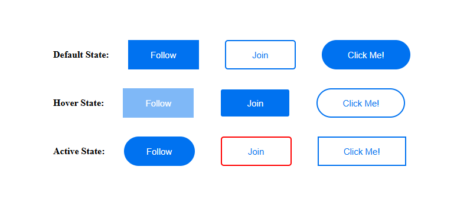
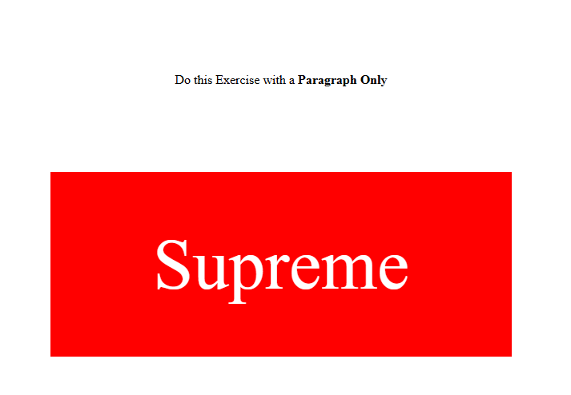
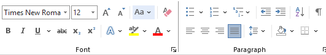
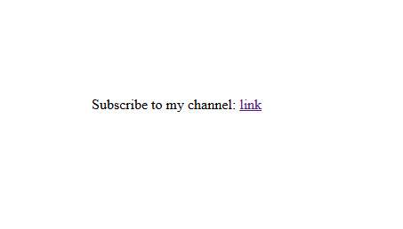
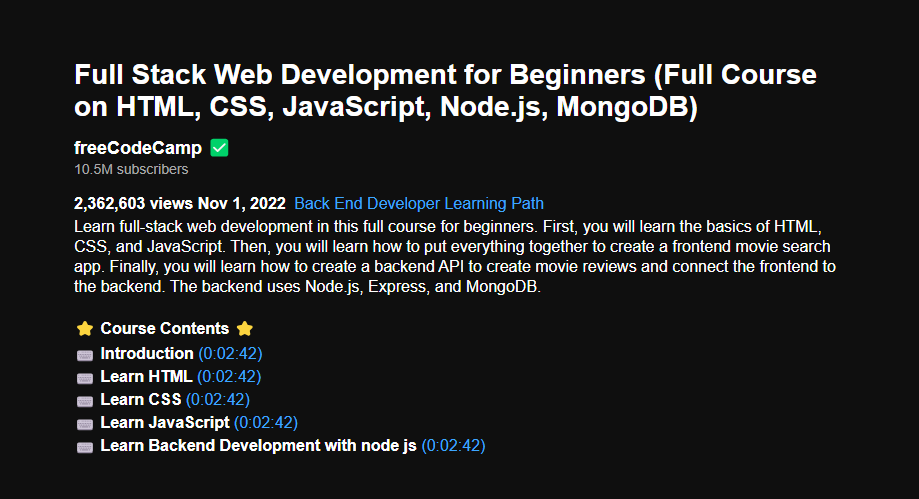
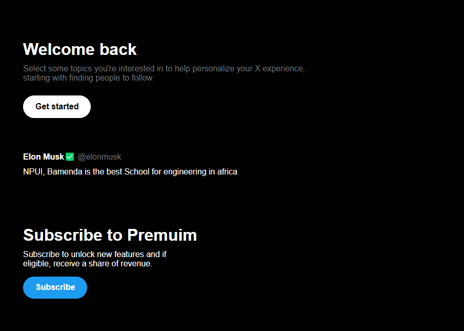

# 3. Pseudo-classes, Typography, and the CSS Box Model: Refactoring Our Code

## 1. Pseudo-classes

A pseudo-class is a special keyword added to a CSS selector to style an element only in a particular state. In this section of the course, we are going to look at two special CSS pseudo-classes:

### Hover

The `:hover` pseudo-class is used to style an element only when a user's mouse is hovering over that element. It follows this format:

```css
.selector:hover {
  property: value;
  property: value;
  /* ... */
}
```

> (do an example here)

### Active

The `:active` pseudo-class allows us to style an element only when the user clicks on that element. It follows this format:

```css
.selector:active {
  property: value;
  property: value;
  /* ... */
}
```

> (do an example)

### Transitions

By default, changes that occur when elements are in a hover or active state are immediate. However, CSS provides a property called `transition` that is used to smoothly animate the changes between states. It follows this format:

```css
.selector:active {
  transition: property time_in_seconds;
}
```

> Example: Let us now recall our subscribe button from the beginning of the course and build something similar using the concepts we just learned.

> > Exercise: Build the following UI with default, hover, and active states:
> > 

---

## 2. CSS Box Model

The CSS Box Model is a concept that determines how much space an element occupies on a web page and its distance from other elements.

Before we dive deeper into this concept, let us look at a tool provided by our web browsers to better understand the CSS Box Model, called **Chrome DevTools**.

### How to Access Chrome DevTools

#### Manually

- **Right-click** on your web page.
- Select **Inspect**.
- A new section should appear on the web page.

#### Using a Shortcut

`Ctrl + Shift + I` (Windows/Linux) or `Cmd + Option + I` (macOS)

> Analyze an element with the help of Chrome DevTools with the interns.

### Elements of the Box Model

#### 1. Borders

We have already discussed borders with our buttons.

#### 2. Margins

Margins are used to define the space that surrounds an element. A margin can be applied to the left, right, top, or bottom of an element.

#### 3. Padding

Padding defines the space between the content and the border of an element. It, too, can be applied to the left, right, top, or bottom.

#### Different Ways of Adding Margins and Padding

##### Method 1: By Direction

Styling an element's margin or padding by direction looks like this:

```css
.btn {
  margin-left: 2px;
  margin-right: 2px;
  margin-top: 2px;
  margin-bottom: 2px;
}
```

or

```css
.btn {
  padding-left: 2px;
  padding-right: 2px;
  padding-top: 2px;
  padding-bottom: 2px;
}
```

##### Method 2: By Dimensions

You can also use shorthand to apply values by dimensions:

```css
.selector {
  property: top-bottom-value left-right-value;
}
```

For example:

```css
.btn {
  margin: 2px 2px;
}
```

or

```css
.btn {
  padding: 2px 2px;
}
```

> Example (walkthrough): Rebuild the subscribe button using the Box Model concepts.

> **Note:** Why would you choose to style an element with padding rather than height and width? **Most of the time, elements are designed without knowing exactly the content they will hold. For example, buttons can be designed without knowing exactly what text they will contain. If you use fixed height and width, then if the text is too long, it may overflow the button and cause inconsistency. With padding, we do not have this problem.**

> Exercise: Build the following UI using only a paragraph:



---

## 3. Typography



Most of us are familiar with the above image; this is the toolbar in Word that allows us to modify how text looks in a document. CSS provides us with an array of properties to do the same.

### Some Fundamental CSS Typography Concepts

> Each concept will be demonstrated with an example paragraph.

List of properties to test:

- font-size
- font-family
- font-weight
- font-style
- text-align
- text-decoration
- color
- width
- line-height

### Nesting Other Elements Within Paragraphs

HTML provides an inline container that lets us add other elements within paragraphs, called a `span`, written as follows:

```html
<span>content</span>
```

#### Nesting a Span in a Paragraph

To nest a span within a paragraph, do as follows:

```html
<p>Content <span>span content</span></p>
```

> **Note:** A span within a paragraph can have its own class, and its content can be styled differently from that of the paragraph. **(do an example)**

> Example (walkthrough): Build the following UI:



> Final Example: Let us work on a small project that utilizes all the knowledge we've acquired so far. Build the following UI:



> **Weekend Assignment:** Build the following UI on your own.



---
