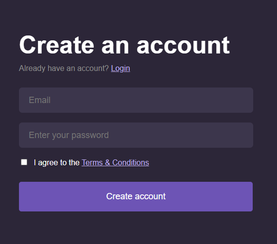

# Lesson 4: Introduction to Beginner CSS

## Part 1: Some Other Pre-Beginner Concepts to Know

### 1.1 External CSS

So far, we have been working with the `<style>` tag to add CSS styling to our elements. However, on a professional scale, we use external CSS.

> **What is External CSS?**  
> External CSS means writing CSS in a separate file from your HTML and then linking them together.

#### How to Achieve This

- **Create a CSS file:**  
  Create a file called `style.css` (always use the `.css` extension).

- **Link the CSS file in your HTML:**  
  In your HTML file, add the following tag within the `<head>` section:

  ```html
  <link rel="stylesheet" href="style.css" />
  ```

- **Provide the correct path:**  
  For the value of the `href` attribute, provide the relative path to your CSS file.

#### 1.1.1 How to Link Files in HTML

1. **Absolute Paths**

   An absolute path specifies the full location of a file on your system. For example, if you were navigating from your computer's C: drive, it might look like:

   ```plain
   C:\Users\SPVCEMVN\Desktop\Internship HTML-CSS-JS\styles.css
   ```

2. **Relative Paths**

   A relative path describes where a file is located in relation to the current document. For example:

   ```plaintext
   ../../styles.css
   ```

   or

   ```plaintext
   ./styles.css
   ```

   _(Note: `../../styles.css` navigates up two directories, while `./styles.css` refers to a file in the current directory.)_

**We will only use relative paths throughout this course.**

> **Why Use a Relative Path?**
>
> - A relative path specifies the location of a file relative to the current document (or the root of the project), making it flexible regardless of where the website is hosted.
> - An absolute path specifies the full location of a file (e.g., `C:/Users/YourName/Desktop/image.jpg` or `http://example.com/image.jpg`), which can cause issues when moving files between environments.

---

## Part 2: Working with Images

### How to Download an Image from the Internet

- **Search:** Look for an image on Google.
- **Right-click:** Right-click on the image you want.
- **Save:** Click on "Save image as..."
- **Store:** Save the image on your computer.

### The Image Element

To add an image to a webpage, use the `` element as follows:

```html

```

_(Explain the tag in detail.)_

### The `object-fit` Property

The `object-fit` property defines how an image will fit within its container. We will look at three main values for this property:

1. **cover**  
   Scales the image to fully cover the container while maintaining its aspect ratio. The disadvantage is that it might crop the image.
2. **fill**  
   Stretches the image to completely fill the container, ignoring the aspect ratio (this can distort the image).
3. **contain**  
   Scales the image to fit inside the container while maintaining its aspect ratio, leaving empty space if needed.

> **Example:** Build the following UI:  
> 

**Exercise:** Build the following UI on your own:  


---

## Part 3: Introduction to Form Elements

Forms are components of web applications that allow users to send data to the server. The HTML element for a form is as follows:

```html
<form>...</form>
```

Inside the `<form>` element, you can include various elements to create the forms we use in our everyday lives. Let’s look at two fundamental elements:

1. **Labels**

   ```html
   <label for="input-id">Label Text</label>
   ```

2. **Input Fields**

   ```html
   <input type="text" placeholder="Enter text here" />
   ```

The `type` attribute for the `<input>` field determines which type of input is displayed on the web page. For example:

```html
<input type="password" placeholder="Enter your password" />
```

The `placeholder` attribute provides a default text inside the input field that disappears when the user starts typing.

Some common input types include:

- `text`
- `number`
- `email`
- `password`
- `tel`
- `search`
- `date`
- `radio`
- `checkbox`
- _etc._

Each input type behaves differently.

> **NB:** Aside from form elements, any HTML element can be placed within the `<form>...</form>` tag.

---

## Part 4: The Display Property

The `display` property in CSS defines how an element is rendered on a webpage. We will study two basic values of this property:

1. **block:**  
   The element occupies the full width available on the webpage, starting on a new line.
2. **inline-block:**  
   The element takes up only as much width as necessary and can sit inline with other elements.

_(Include examples here.)_

**Example:** Let’s build the following UI together:  


**Exercise:** Try building the following UI on your own:  


---

## Part 5: The `<div>` Element

The `<div>` element is essentially a container that can hold other elements, including nested `<div>` elements. We will explore it more in later lessons, but for now, here is how it is written:

```html
<div></div>
```

**Example of using a `<div>`:**

```html
<div>
  <p>Hi there</p>
  <button>Click me!</button>
</div>
```

> **NB:** The `<div>` is one of the most important and widely used elements in web development. For a fun exercise, inspect any webpage of your choice and observe how many `<div>` elements are used.

(do a small grid example)

**Assignment:**


---
